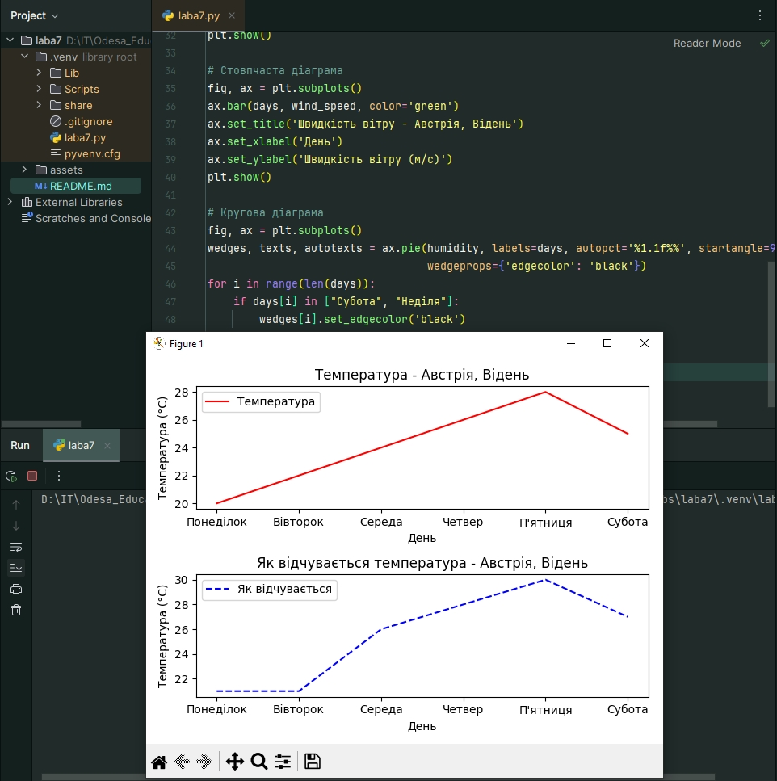
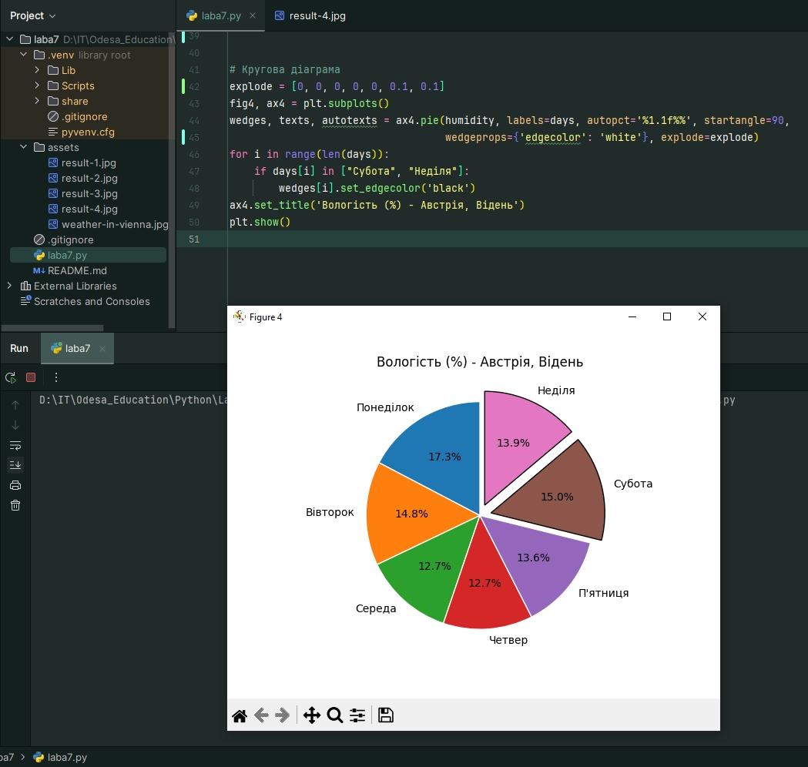

# Лабораторна робота 7. Створення програми для візуалізації даних з використанням Mathplotlib

На цій лабораторній роботі побудувано за допомогою засобів Mathplotlib графіки для погоди на 6 діб для міста Відень. Побудовані графіки/діаграми з категорій «лінійна», «стовпчаста», «кругова».

- Побудувано 2 лінійних графіка, що демонструють температуру і те, як відчувається температура ці графіки розміщено двома способами: на одному полі та на розділених полях. Підписано осі та діаграму, створено легенду, обрано різні типи ліній, задано кольори ліній. У назву діаграми включено назву країни та міста (Австрія, Відень).
- Побудувано стовпчасту діаграму, що демонструє швидкість вітру. Підписано осі та діаграму. У назві діаграми включено назву країни та міста.
- Побудувано кругову діаграму, що демонструє вологість %.Підписано діаграму та частини діаграми. Відокремлено сектора, що припадають на вихідні дні. У назві діаграми включено назву країни та міста.

Cкріншоти з погодного сайту, що демонструють дані, які були використані при побудові графіків:

Cкріншоти роботи програм:

